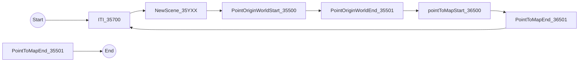

# ExperimentalProcedure 

## Connect equipments 

### Desktop computer or [Backpack](https://www.hp.com/us-en/shop/tech-takes/hp-vr-backpack-g2-review)
- [ ] Computer.
- [ ] Empatica.
- [ ] Enobio 32ch EEG.
- [ ] External screen.
- [ ] ECG Cable and pads.
- [ ] Omnicept VR headset.

## Setup
- [ ] Turn on equipment
- [ ] Empatica:
   - [ ] Turn on E4 streaming server
   - [ ] Turn on empatica
   - [ ] check if paired on E4 streaming server
   - [ ] Fit wristband tight
- [ ] Omnicept 
   - [ ] perform the eye calibration, Click on the HP logo in the task bar.
- [ ] BackPack
   - [ ] Start Bonsai 
   - [ ] Start Unity
   - [ ] Bonsai check if receiving data from all sensors
      - [ ] Unity
      - [ ] Omnicept
      - [ ] Empatica 
      - [ ] ECG 
  - [ ] ecg
     - [ ] Fit gel electrodes (blue on left nipple, black on right nipple, red on belly alligned with black)
     - [ ] check ecg signal.
  - [ ] Stop bonsai
  - [ ] EEG
    - [ ] Fit eeg cap
    - [ ] Fit ear pinch reference electrode
    - [ ] Connect usb cable
    - [ ] Check flex cables from NE to eeg cap 
    - [ ] Turn on Ne
    - [ ] Start nic 
      - [ ] choose usb device 
      - [ ] start protocol 
      - [ ] allow syncronizing
      - [ ] wiggle red electrodes
  - [ ] Fit Omnicept VR Headset

 ## Trials 
 - [ ] Configure trial metadata in bonsai workflow
 - [ ] start recordinng EEG
 - [ ] press play on bonsai start
 - [ ] press play in Unity
 - [ ] NIC stop eeg
 - [ ] stop bonsai 
 - [ ] copy NIC data to the current data folder 

## Remove setup
- [ ] remove Omnicept headset
- [ ] EEG
  - [ ] turn off NE
  - [ ] remove usb cable
  - [ ] remove ear pinch reference electrodes
  - [ ] remove eeg cap
- [ ] remove ecg electrodes.
- [ ] remove empatica wirstband
- [ ] remove backpack

## Video files description 
- A video with name VRImage.avi is created for the entire session
## LSL EEG Codes description
LSL messages are sent to the EEG using the following codes:
      - 0:35000 Incremental SyncPulse
      - 35YXX: Y SpawnId is the ID where the subject spawns in the world, XX means the SceeneType that was being played, optimistic, pessimist
      - 35500 Start PointToOriginMap
      - 35501 Stop PointToOriginMap
      - 35600 Star PointToOriginWorld
      - 35601 Stop PointToOriginWorld
      - 35700 for ITI

### Experiment Protocol 
The sequence of the experiment protocol that is sending Lsl messages to the EEG is the following:

- ITI has a fixed duration and each time it starts the system send the code 35700 to the Enobio via LSL.
- When a new spatial trial starts it sends a LSL message with a code that describes which SpawnID and SceneType is being presented, 35YXX: 
    - Y SpawnId is the ID where the subject spawns in the world
    - XX means the SceeneType that was being played, optimistic, pessimist
- When the subject starts pointing to the origin LSL message with code 35500 is sent.
- When the subject stops pointing to the origin LSL message with code 35501 is sent.
- When the subject starts pointing to the map LSL message with code 36500 is sent.
- When the subject stops pointing to the map LSL message with code 36501 is sent.

### Space and time Sync 
The EEG data is synchronized with the acquisition system via a random time generator, each time the timer ticks a new **incremental** LSL message is sent ro the EEG, these messages start with 1. 

### Acessing the data
All these events are also recorded in the pluma harp streams and a spatial&Time correlation can be obtained. These correlations are exported to CSV files using the https://github.com/emotional-cities/notebooks